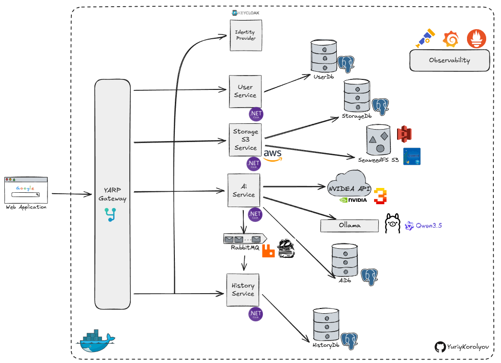
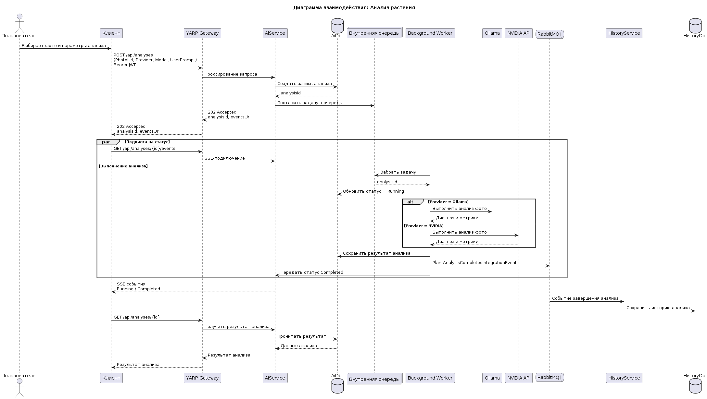

# AiGarden - ИИ для ухода за растениями

`AiGarden` — это микросервисное backend-приложение для анализа состояния растений по фотографии. Пользователь загружает изображение, запускает AI-анализ через выбранную модель, получает результат и может просматривать историю завершенных анализов.

## Перспективы развития

В будущем `AiGarden` может стать цифровым помощником для садоводства.

Основные направления:

- ИИ-анализ упаковок семян
- карта сада с отметками растений и сортов
- история посадок по месяцам и годам
- привязка к региону и погоде
- предупреждения о заморозках, засухе и дождях
- рекомендации по уходу и размещению растений на участке

## Диаграмма компонентов

## Диаграмма взаимодействия

## Стек технологий

- .NET 10
- ASP.NET Core Web API
- YARP Reverse Proxy
- Entity Framework Core
- PostgreSQL
- Keycloak
- JWT Bearer Authentication
- RabbitMQ
- MassTransit
- SeaweedFS S3
- AWS SDK for S3
- Ollama
- NVIDIA API
- OpenTelemetry
- OpenTelemetry Collector
- Prometheus
- Grafana
- FluentValidation

## Основные Use Cases

### Use Case 1. Авторизация

- Пользователь логинится через Keycloak
- Клиент получает JWT
- Все запросы идут через Gateway с bearer token

### Use Case 2. Загрузка фото

- Клиент отправляет файл в StorageS3Service
- Сервис кладет файл в SeaweedFS S3
- Сервис сохраняет метаданные в StorageDb
- Клиент получает публичный URL фото

### Use Case 3. Анализ растения

- Клиент отправляет `POST /api/analyses` с `PhotoUrl`, `Provider`, `Model`, `UserPrompt`
- AiService создает запись в AiDb
- AiService ставит задачу во внутреннюю очередь
- background worker запускает анализ
- AiService вызывает Ollama или NVIDIA API
- результат сохраняется в AiDb
- AiService публикует событие в RabbitMQ
- HistoryService получает событие и сохраняет историю
- клиент может читать статус через SSE
- клиент может получить итог через `GET /api/analyses/{id}`

### Use Case 4. История

- Клиент вызывает `GET /api/history/me`
- HistoryService читает данные из HistoryDb
- Возвращает список завершенных анализов
